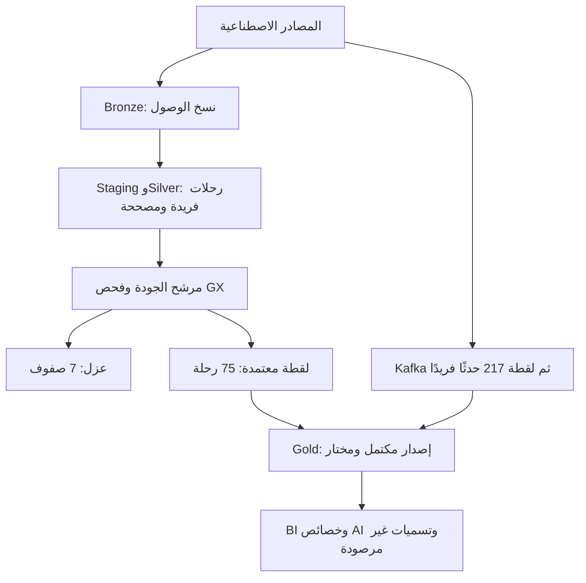

# DECISIONS — سجل القرارات المعمارية

أمل خوتاني — Amal Khotani. برنامج **هندسة البيانات الحديثة لأنظمة الذكاء الاصطناعي — Modern Data Engineering for AI Systems (SDA-DSC-214)**، [أكاديمية سدايا](https://github.com/SDAIAAcademy). #SDAIAAcademy

مواد الدورة ودوالها: **ميعاد المري — Meaad Al-Marri**. هذه ملاحظات مبنية على المخرجات المحفوظة في الدفتر المرفوع والتقارير الأصلية؛ لم يُعد تشغيل Spark أثناء إعدادها. تفاصيل البيئة وبصمات الأدلة وحدود التحقق في [EVIDENCE_INDEX.md](EVIDENCE_INDEX.md).

## نطاق السجل

يوثق هذا السجل الاختيارات المنفذة في التمرين وتفسيرها، ويعرض البدائل للمقارنة؛ لا يدّعي أن كل بديل نُفذ أو قيس. المصادر والأدلة مشتركة في [EVIDENCE_INDEX.md](EVIDENCE_INDEX.md).

## القرارات وتبعاتها

| القرار المنفذ | السياق والبديل | الدليل والسبب | التبعات وشرط إعادة النظر |
|---|---|---|---|
| حفظ نسخ الوصول في Bronze | بديل المقارنة: حذف التكرار عند الاستقبال | 144 نسخة تمثل 72 رحلة؛ نحتفظ بأثر الإرسال | مساحة وتتبع إضافيان؛ تعاد مراجعة سياسة الاحتفاظ عند أحجام إنتاجية |
| فصل التهيئة وSilver عن المصدر | بديل المقارنة: تعديل الملفات الخام | توحيد 10 تسميات مدن مع بقاء الدليل الخام | يزيد عدد الطبقات، ويتيح تفسير التحويل وإعادته |
| دمج الرحلات بمفتاح ومراجعة | بديل المقارنة: إلحاق كل إرسال أو اختيار آخر وصول دائمًا | 75 رحلة ورفض تعارض مراجعة واحدة؛ 18→23 يزيد الإجمالي 5 فقط | يحتاج سياسة ترتيب وتعارض؛ لم يختبر عدة كتّاب |
| استخدام Delta | بديل المقارنة: ملفات CSV فقط | معاملات وسجل نسخ وقيود وRESTORE حقيقية | حمل وصف وتخطيط أعلى في القياس الصغير؛ لا يدّعى أنه أسرع في كل قراءة |
| تشغيل موصل Kafka بعملية Spark جديدة | جلسة JVM السابقة افتقدت مصدر kafka | نجح اللاب 05 بعد CLI مستقل و13 فحصًا | بدء عملية وحزم إضافية؛ يعتمد التكرار على تهيئة البيئة مسبقًا |
| فصل مفتاح النقل عن مفتاح الحدث | بديل المقارنة: عد كل رسالة حدثًا جديدًا | 219 وصولًا مقابل 217 حدثًا؛ offsets متطابقة | يحتاج فحص تعارض المحتوى قبل إزالة التكرار |
| بوابة اعتماد بعد إعادة الفحص | بديل المقارنة: نشر subset من مرشح فاشل فورًا | مرشح 82 فشل، ومرشح 75 مستقل اجتاز GX | تكلفة فحص إضافي مقابل ضبط النشر؛ جمع pandas مقيد بعينة صغيرة |
| صيانة على نسخ معزولة | بديل المقارنة: تجربة DELETE/schema على Silver المتتابعة | trusted_silver_unchanged وفحوص الصيانة | تكرار تخزين تعليمي؛ تنظف النسخ بعد فترة المراجعة المقررة |
| نشر إصدار Gold مكتمل ثم اختياره | بديل المقارنة: تحديث جداول العرض واحدة واحدة أثناء البناء | الفشل بعد جدول واحد لم يستبدل الإصدار السابق | أثر نشر محلي وتعقيد مؤشرات؛ لا يثبت معاملات متعددة الجداول أو ناشرين متزامنين |
| تجميع GPS قبل ربط الرحلات | بديل المقارنة: join مباشر لكل حدث | 75 fact rows و1880.60 ريال و217 حدثًا | حماية حبة البيانات؛ تعدل التجميعات إذا تغير سؤال التحليل |
| مدخلات AI متاحة عند القرار | بديل المقارنة: جميع أعمدة الرحلة المكتملة | فحص availability وUNOBSERVED لأهداف غير معروفة | لا تدريب أو دقة حاليًا؛ يلزم جمع labels لاحقًا دون تسرب |

## التشغيل والاستعادة

الترتيب: يوم 1 للمصدر وBronze والقياس، ثم يوم 2 للتهيئة وSilver وdbt، ثم يوم 3 للتصحيح والصيانة، ثم يوم 4 للتدفق والجودة، ثم يوم 5 للتعافي والتقديم. تحفظ مساحة Bronze نفسها ومؤشرها. في جلسة جديدة تستعاد المخرجات بمساراتها النسبية في نسخة مستودع معزولة؛ لا تُستبدل مساحة حية مختلفة ولا تحذف محاولات الفشل.

اليوم الخامس يقرأ لقطات مكتملة من اليوم الرابع؛ لا يحتاج إعادة إرسال Kafka لاستخدامها. إعادة لاب 07 عمدًا تستلزم إعادة لاب 08 بعده ثم ZIP جديد ليرتبط التصدير بالإصدار المختار. الدفاتر المفصولة تحفظ نتائج التنفيذ الأصلي؛ أضيفت خلية إعداد واحدة غير منفذة إلى اليوم الخامس، ولم يُدّع اختبار Run all نظيف بعد التنظيم.

## القيود المؤثرة

البيانات صغيرة وثابتة، والبيئة محلية تعليمية، والمعرفات اصطناعية. لا لوحة تشغيل إنتاجية ولا تدريب نموذج ولا ضمان exactly-once شامل لكل أعطال البنية. تفاصيل القياس في [BENCHMARKS.md](BENCHMARKS.md)، والوصول والاحتفاظ في [GOVERNANCE.md](GOVERNANCE.md). لم يُطبع معرّف Git الفعلي لكل جلسة قديمة؛ معرّف التسليم النهائي سيوثق الملفات المرفوعة، ولا يثبت بأثر رجعي نسخة الكود التي نفذت سابقًا.

## معالجة فقد ملفات dbt

بعد التحقق من غياب الأرشيف القديم، استُعيد Day05 ZIP في نسخة مستودع جديدة وشُغل `run_dbt_lab` في عملية جديدة. ينشئ المشغّل مساحة dbt معزولة وينسخ لقطات Bronze الأصلية مع الحفاظ على توقيتات الاستقبال. لا نعيد تحويلات اليوم الثاني فوق Silver المصححة في اليوم الثالث، ولا نصطنع تقريرًا من النص المطبوع. نجحت المحاولة الجديدة `83b24dcbe27141009fec1b6eae58baef` وحُفظت أوامرها وتوثيقها. سجل الاستعادة في [day02/DBT_RECOVERY.ipynb](day02/DBT_RECOVERY.ipynb).
